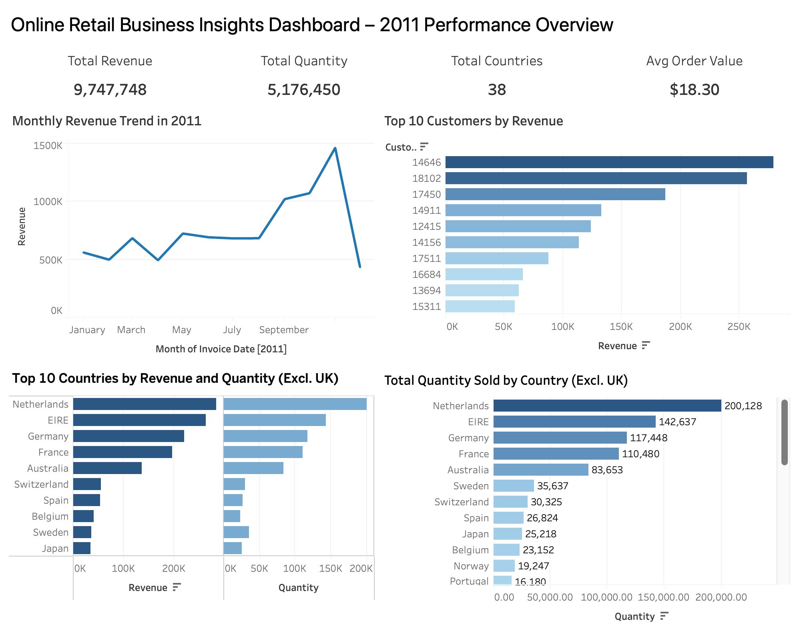
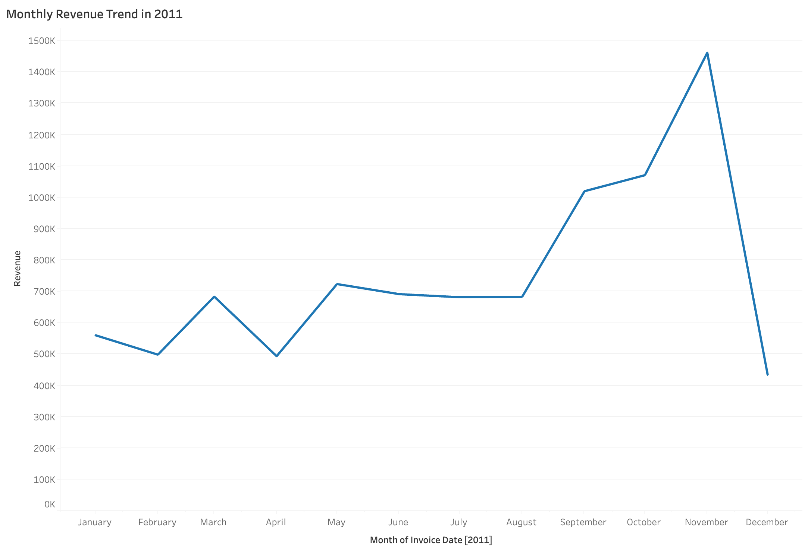
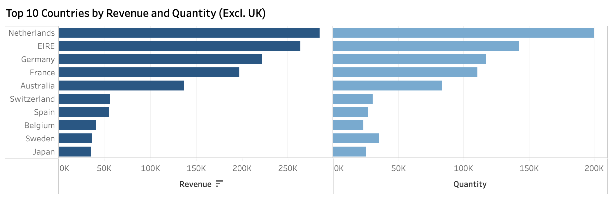
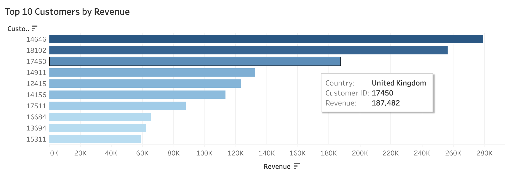
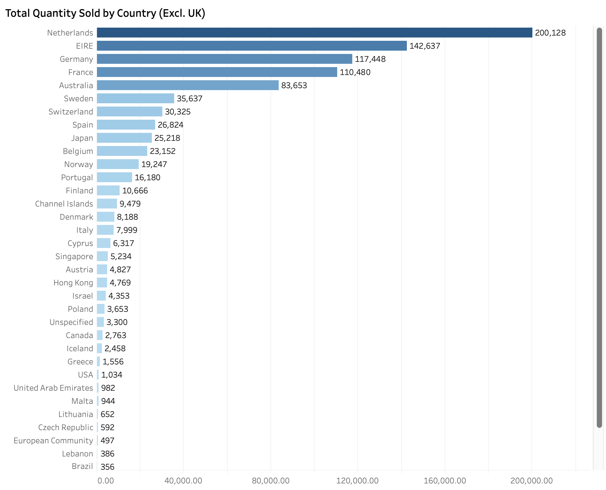

# Tata Retail Dashboard (Tableau)

This project was completed as part of the Tata Forage Virtual Internship. It provides a data-driven performance overview of an online retail business in 2011, using Tableau to answer four key business questions from the CEO and CMO. The objective was to deliver strategic insights that inform business decisions around seasonality, market expansion, and customer targeting.

The visualisations are presented below with supporting explanations and business context.

---

## Final Dashboard Overview

The full Tableau dashboard brings together key performance indicators and four targeted visualisations to address leadership-level questions. The design is clean, readable, and structured to support non-technical stakeholders in drawing quick conclusions.

---

## Q1: Monthly Revenue Trend (2011)

**Business Objective:**  
The CEO requested a view of revenue performance across 2011, broken down by month. The goal was to identify any seasonal trends and pinpoint periods of high revenue for more effective forecasting and resource planning.

This line chart visualises monthly revenue for 2011. It reveals a strong seasonal trend with a sharp spike in November, likely due to holiday-related shopping. This insight can help the business prepare for high-volume periods by aligning marketing, inventory, and staffing strategies in advance of peak months.

---

## Q2: Top 10 Countries by Revenue and Quantity (Excl. UK)

**Business Objective:**  
The CMO was interested in understanding which countries, excluding the United Kingdom, were generating the most revenue and sales volume. The goal was to identify markets with both high spending and high demand to support regional expansion and campaign targeting.

This dual bar chart compares the top 10 countries (excluding the United Kingdom) by revenue and quantity sold. The Netherlands and Ireland lead across both metrics, followed by Germany and France. These markets demonstrate high levels of both spending and engagement, making them prime candidates for regional marketing investment or expansion.

Revenue is shown in a darker shade of blue, and quantity in a lighter shade for visual clarity.

---

## Q3: Top 10 Customers by Revenue

**Business Objective:**  
The CMO asked for a breakdown of the top 10 customers by revenue. The purpose was to identify high-value customers who could be prioritised for loyalty efforts, retention strategies, or targeted promotions.

This horizontal bar chart ranks the top 10 customers by total revenue. The chart helps business leaders easily identify the most valuable customers for retention strategies or personalised outreach.

While the United Kingdom is excluded from country-level visuals, it is intentionally included here because customer-level targeting focuses on individual value rather than region. This ensures that high-revenue customers are not excluded regardless of location.

---

## Q4: Total Product Demand by Country (Excl. UK)

**Business Objective:**  
The CEO wanted a complete view of product demand across all countries, excluding the UK. The aim was to identify high-demand markets to guide future expansion plans. The visual needed to display all countries clearly, without requiring interactivity or hovering.

This horizontal bar chart displays total quantity sold across all countries (excluding the United Kingdom). The chart was designed to present the full list of countries in a clear, ranked format, allowing decision-makers to quickly identify markets with the highest demand.

The Netherlands, Ireland, and Germany again emerge as top performers. Although some scrolling is required due to the number of countries shown, the chart maintains clarity and supports the CEO’s goal of identifying high-opportunity regions for future expansion.

---

## Files Included

- `Tata_Retail_Dashboard.twb`: Packaged Tableau workbook
- `screenshots/`: Folder containing PNG images of all visualisations

---

## Tools Used

- Tableau
- Excel (initial data review and field inspection)
- Data wrangling, calculated fields, and custom filtering
